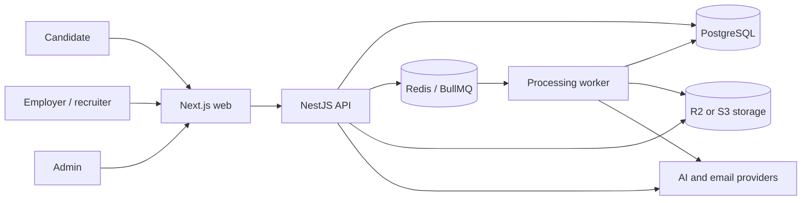
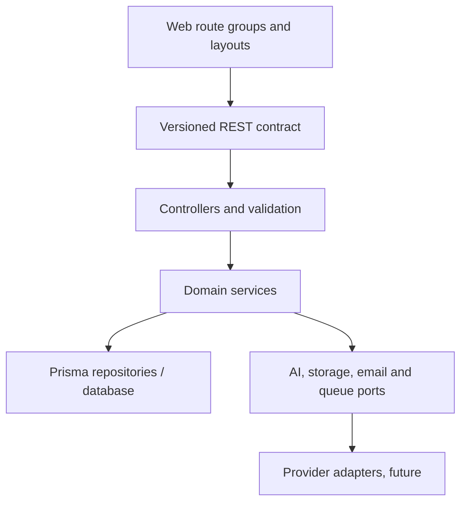
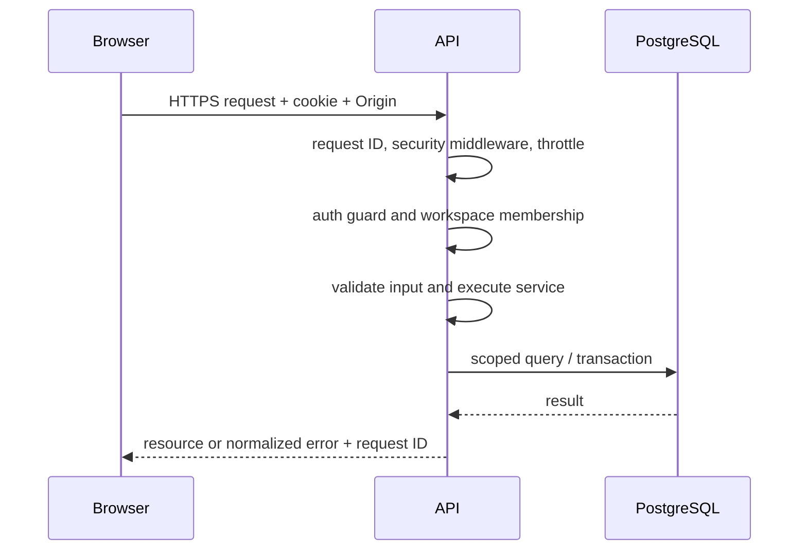
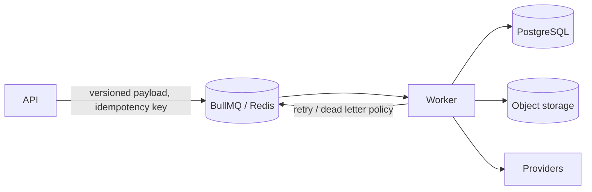
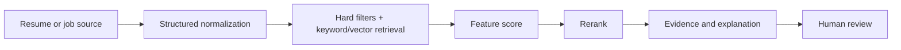
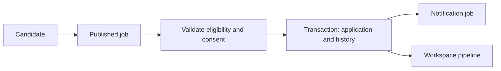

# System architecture

## Context



## Application boundaries



The web app renders public pages and protected candidate, workspace, and admin shells. It uses the API for identity and authorization. The API is a modular monolith; domain modules are introduced when workflows exist. Initial modules are auth, workspaces, health. Future modules: users, companies, candidates, jobs, applications, matching, search, files, notifications, interviews, assessments, analytics, admin and integrations. Avoid empty modules.

## Request lifecycle



## Background jobs



Queue names: `resume`, `candidate`, `job`, `match`, `notification`, `assessment`, `analytics`. Job names and payload envelope live in `packages/shared`. Redis is optional during Phase 0; no request path depends on it. Add workers only with durable idempotency, retry policy, and observability.

## AI flow



Domain AI services call `packages/ai` interfaces. Provider adapters handle timeout, retry, usage, and redacted telemetry. Never log raw resumes by default. An LLM never owns the entire rank.

## Authentication and application flows

```mermaid
sequenceDiagram
  Browser->>API: POST /auth/login
  API->>PostgreSQL: verify user password; store hashed session token
  API-->>Browser: HttpOnly SameSite cookie
  Browser->>Web: Navigate protected route
  Web->>API: GET /auth/me with cookie
  API-->>Web: viewer or 401
```



The application flow is planned, not implemented. Public job viewing must require published status. Submission must be idempotent and prevent duplicate active applications.

## Operations

PostgreSQL is the source of truth. Object storage uses short lived signed URLs and private keys. Redis serves background jobs, rate limits, temporary cache, and locks when those features are implemented. Structured JSON logs include request ID, route, duration and status. Sentry and PostHog adapters are future work. API errors are normalized; stack traces stay server-side. Deploy the web and API separately; workers are separate processes when activated.
