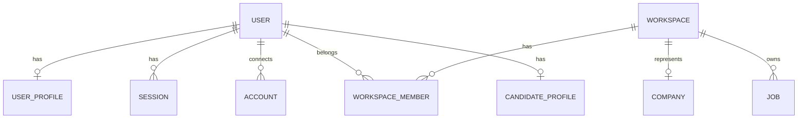

# Database schema and tenant boundaries

## Implemented physical schema

`User` (global role, credentials), `UserProfile`, `Account` (OAuth identity mapping), `Session` (hashed opaque token), `Workspace`, `WorkspaceMember` (role and unique membership), `Company` (one per workspace), `CandidateProfile`, `Job` (draft/published/closed). All IDs are UUIDs. Mutable records have timestamps; user, workspace, company and job have soft deletion. Emails and slugs are unique. Jobs have `(workspaceId, slug)` uniqueness and `(workspaceId, status, createdAt)` index. Session token hashes and expiry are indexed.

The company is a workspace-owned profile; users may join multiple workspaces. Platform roles do not grant workspace membership. Every employer query must scope by workspace ID after an authenticated membership check. Do not accept a client supplied workspace ID as proof of access. Joins and writes must use server-resolved IDs; composite keys and foreign keys should be added to new tenant tables. Soft-deleted workspaces are inaccessible.

## Planned logical schema

```mermaid
erDiagram
 CANDIDATE_PROFILE ||--o{ RESUME : owns
 RESUME ||--o{ RESUME_VERSION : versions
 CANDIDATE_PROFILE ||--o{ CANDIDATE_EXPERIENCE : has
 CANDIDATE_PROFILE ||--o{ CANDIDATE_EDUCATION : has
 CANDIDATE_PROFILE ||--o{ CANDIDATE_SKILL : has
 SKILL ||--o{ CANDIDATE_SKILL : normalizes
 CANDIDATE_PROFILE ||--o{ CERTIFICATION : has
 CANDIDATE_PROFILE ||--o{ LANGUAGE : speaks
 CANDIDATE_PROFILE ||--o| CANDIDATE_PREFERENCE : sets
 WORKSPACE ||--o{ JOB : owns
 JOB ||--o{ JOB_SKILL : needs
 JOB ||--o{ JOB_REQUIREMENT : needs
 JOB ||--o{ JOB_LOCATION : offers
 JOB ||--o{ APPLICATION : receives
 CANDIDATE_PROFILE ||--o{ APPLICATION : submits
 APPLICATION ||--o{ APPLICATION_STAGE_HISTORY : records
 APPLICATION_STAGE ||--o{ APPLICATION_STAGE_HISTORY : identifies
 WORKSPACE ||--o{ CANDIDATE_TAG : defines
 WORKSPACE ||--o{ CANDIDATE_NOTE : owns
 WORKSPACE ||--o{ SAVED_CANDIDATE : owns
 CANDIDATE_PROFILE ||--o{ SAVED_JOB : saves
 JOB ||--o{ MATCH_RESULT : scores
 MATCH_RESULT ||--o{ MATCH_EVIDENCE : explains
 APPLICATION ||--o{ INTERVIEW : schedules
 INTERVIEW ||--o{ INTERVIEW_PARTICIPANT : includes
 WORKSPACE ||--o{ ASSESSMENT : owns
 ASSESSMENT ||--o{ ASSESSMENT_INVITATION : sends
 USER ||--o{ NOTIFICATION : receives
 WORKSPACE ||--o{ AUDIT_LOG : records
 PLAN ||--o{ SUBSCRIPTION : defines
 WORKSPACE ||--o{ SUBSCRIPTION : has
 WORKSPACE ||--o{ USAGE_RECORD : tracks
 WORKSPACE ||--o{ INTEGRATION : configures
 WORKSPACE ||--o{ WEBHOOK_ENDPOINT : configures
```

Future recruiter profile can be a user extension, with membership determining access. Role and Permission can become configurable tables if product needs custom roles; current code uses explicit enums and grants. Do not add them without a real role customization requirement. Planned indexes: workspace-first indexes for all employer tables; candidate/job IDs and timestamps for applications; `(candidateId, jobId)` uniqueness for saves and application idempotency; full text indexes for retrieval; pgvector HNSW/IVFFlat only when embeddings are generated at scale. Audit and usage records should be append-only. Decide retention and deletion rules before introducing resume data.

Database migration state is in [Current State](23-CURRENT-STATE.md). Schema changes require a reviewed migration, tenant boundary review, and an update here.
